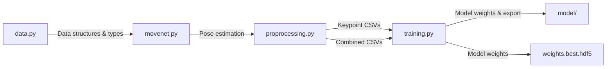

# Yoga Pose Classification: Architecture & Data Flow

## 1. Data Flow Overview

The project processes yoga pose images through several stages to produce a trained model capable of classifying poses from new images. The flow is as follows:

```mermaid
graph TD
    A[Raw Images (yoga_poses/train & test)] --> B[Keypoint Extraction (proprocessing.py + movenet.py)]
    B --> C[Per-pose CSVs (csv_per_pose/)]
    C --> D[Combined CSVs (train_data.csv, test_data.csv)]
    D --> E[Data Normalization & Embedding (training.py)]
    E --> F[Model Training (training.py)]
    F --> G[Best Model Weights (weights.best.hdf5)]
    F --> H[TensorFlow.js Export (model/)]
    H --> I[Web Deployment]
    G --> J[Inference on New Images]
```

### Step-by-Step Data Flow

1. **Image Collection**: Images are organized by pose class in `yoga_poses/train/` and `yoga_poses/test/`.
2. **Keypoint Extraction**: `proprocessing.py` uses `movenet.py` and the MoveNet TFLite model to extract 17 keypoints (x, y, score) from each image.
3. **Per-pose CSVs**: Keypoints for each image are saved in CSV files per pose class in `csv_per_pose/`.
4. **Combined CSVs**: All per-pose CSVs are merged into `train_data.csv` and `test_data.csv`, with class labels.
5. **Data Normalization & Embedding**: `training.py` normalizes keypoints (centering, scaling) and flattens them into 34-dimensional vectors.
6. **Model Training**: A neural network is trained on the processed data, with early stopping and checkpointing.
7. **Model Export**: The best model is saved as `weights.best.hdf5` and exported to TensorFlow.js format for web deployment.
8. **Inference**: The trained model can classify new images by following the same preprocessing and embedding steps.

---

## 2. System Architecture

The system is modular, with each script/module responsible for a specific stage:



### Module Roles
- **data.py**: Defines enums and data structures for keypoints, persons, and categories.
- **movenet.py**: Loads and runs the MoveNet TFLite model, extracting keypoints from images.
- **proprocessing.py**: Orchestrates keypoint extraction for all images, saves per-pose and combined CSVs.
- **training.py**: Loads combined CSVs, normalizes and embeds data, defines and trains the neural network, exports the model.
- **model/**: Stores the exported TensorFlow.js model for web deployment.
- **weights.best.hdf5**: Stores the best Keras model weights for further use or inference.

---

## 3. Model Architecture

The classification model is a simple feedforward neural network designed for pose classification based on normalized keypoints.

### Input
- **Shape:** 34-dimensional vector (17 keypoints × 2 coordinates: x, y)
- **Source:** Normalized and flattened keypoints from each image

### Layers
- **Dense Layer 1:** 128 units, ReLU6 activation
- **Dropout Layer 1:** 0.5 dropout rate (regularization)
- **Dense Layer 2:** 64 units, ReLU6 activation
- **Dropout Layer 2:** 0.5 dropout rate
- **Output Layer:** Number of units = number of pose classes, softmax activation

```mermaid
flowchart TD
    A[Input: 34-dim vector] --> B[Dense(128, relu6)]
    B --> C[Dropout(0.5)]
    C --> D[Dense(64, relu6)]
    D --> E[Dropout(0.5)]
    E --> F[Dense(num_classes, softmax)]
    F --> G[Class Probabilities]
```

### Rationale
- **Simplicity:** The model is intentionally simple to avoid overfitting and to run efficiently on small datasets.
- **Dropout:** Used to prevent overfitting due to limited data.
- **ReLU6:** Chosen for stability and compatibility with quantization/deployment.

---

## 4. Deployment & Export

- **Best Model Weights:** Saved as `weights.best.hdf5` for further training or inference in Python.
- **TensorFlow.js Export:** Model is exported to `model/` directory for use in web applications, enabling real-time pose classification in the browser.

---

## 5. Inference Pipeline

To classify a new image:
1. Extract keypoints using MoveNet (as in preprocessing).
2. Normalize and embed the keypoints (as in training).
3. Pass the 34-dimensional vector to the trained model.
4. Output is a probability distribution over pose classes.

---

## 6. Summary

This architecture ensures a clear, modular, and reproducible pipeline from raw images to deployable pose classification models, leveraging state-of-the-art pose estimation and efficient neural network design. 